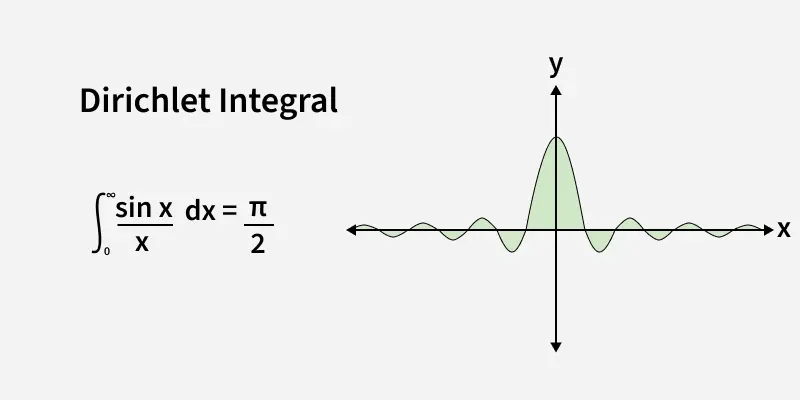

# Numerical Integration of Dirichlet Integral

This repository contains Python files with 3 approaches to numerically integrate the Dirichlet integral ∫ sin(x)/x dx from 0 to ∞.

## About
Attempt to tame the "unsolvable" Dirichlet integral using numerical integration.
